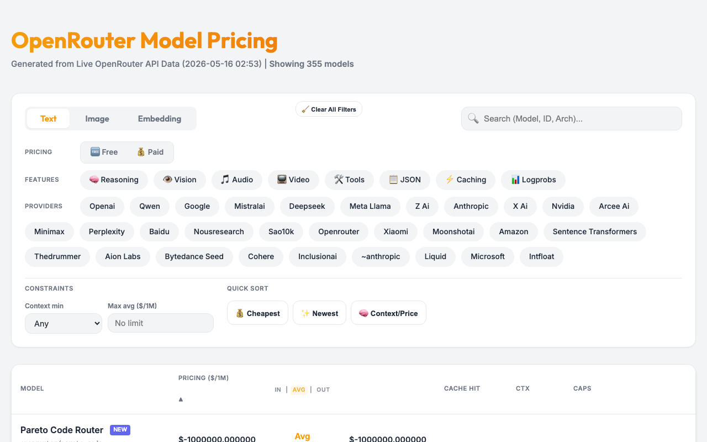

# OpenRouter Pricing & Model List

[](./docs/index.html)



This project fetches model data from the OpenRouter API and generates interactive HTML tables for comparing pricing, capabilities, and context windows of **Text**, **Image**, and **Embedding** models.

## Usage

### 1. Update Data & Generate Lists
Run the automation script to fetch the latest data and rebuild the HTML files:

```bash
./update.sh
```

### 2. View Results
Open `docs/index.html` in your web browser to navigate the generated lists:
- **Text Models**: Pricing (per 1M tokens), context window, capabilities (Reasoning, Vision, Function Calling, etc.)
- **Image Models**: Image generation models with pricing per image.
- **Embedding Models**: Text embedding models with pricing per 1M tokens.
- **Provider Details**: **Click on any model row** to fetch and display detailed pricing and limits for each available provider (OpenAI, Azure, etc.).
- **Interactive Filtering**: Filter by capabilities, exclude free models ("Paid Only"), and search by name.
- **Dashboard**: Unified view with relative price comparison.

## Project Structure

```
├── update.sh              # Main automation script
├── data/                  # Processed JSON data
├── docs/                  # Generated Dashboard (GitHub Pages)
│   ├── index.html        # Main dashboard
│   ├── style.css         # Styles
│   └── app.js            # Interactive logic
├── scripts/
│   ├── get_openrouter_data.py  # Raw data fetcher
│   ├── fetch.py          # Data processor (categorizes models)
│   ├── build.py          # Dashboard builder
│   ├── static/           # Source for CSS and JS
│   │   ├── style.css
│   │   └── app.js
│   └── templates/        # Jinja2 HTML templates
│       └── dashboard.html
└── requirements.txt       # Python dependencies
```

## Features

- **Automated Data Fetching**: Pulls latest model information from OpenRouter API
- **Live Pricing**: Displays current per-token pricing (normalized to 1M tokens)
- **Interactive Dashboard**: Sort, filter, and search models by various criteria
- **Modular Codebase**: Separated HTML, CSS, and JS for maintainability
- **Responsive Design**: Works on desktop and mobile devices
- **GitHub Pages Ready**: Pre-built `docs/` folder for easy deployment

## Requirements

Install dependencies:

```bash
uv pip install -r requirements.txt
```

Or manually:
- Python 3.7+
- `jinja2` - Template engine for HTML generation
- `requests` - For API calls
